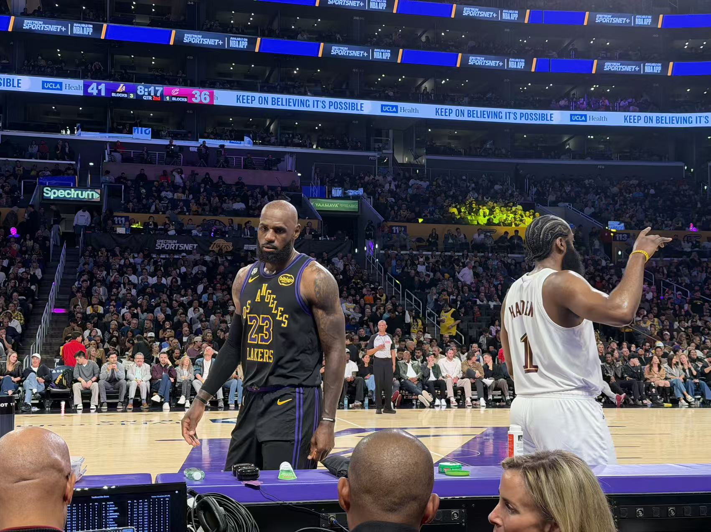
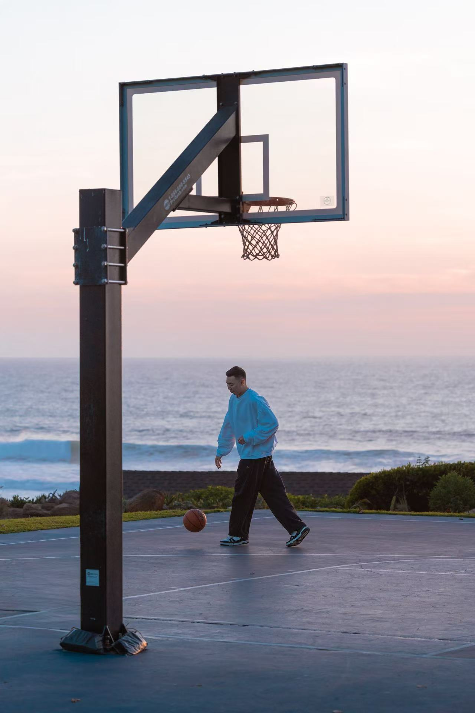
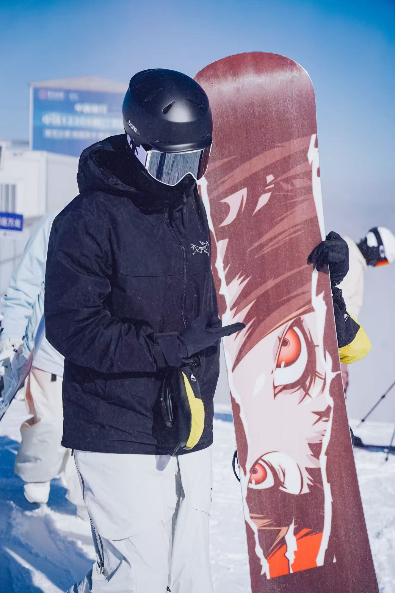
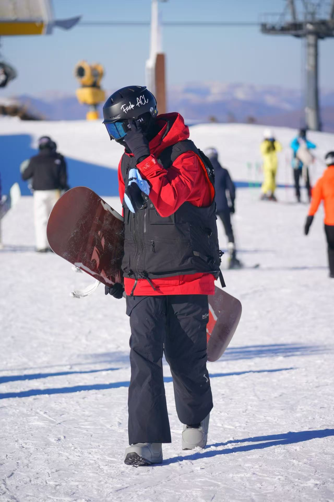

Outside of academics, sports and outdoor activities are a big part of my life.  
Among them, basketball and snowboarding mean the most to me.

## Basketball

Basketball has been the sport I have loved and stayed committed to since childhood.  
It has brought me countless moments of joy, excitement, and unforgettable memories over the years.

At the same time, basketball has also shaped me in a much deeper way.  
In 2024, I suffered a torn ACL in my left knee. In 2025, I experienced another serious setback with a torn meniscus and lateral collateral ligament in the same knee. Since then, recovery has become an important part of my life, and I have continued rehabilitation while staying connected to the game I love.

Because of these experiences, basketball means much more to me than just a sport.  
It has taught me resilience, patience, discipline, and the importance of continuing to move forward even when the process is difficult.

## Snowboarding

Snowboarding is one of the ways I feel freedom most strongly.  
Being on the mountain, surrounded by snow and open space, gives me a feeling that is difficult to describe in words.

What I love most is not only the speed or the challenge, but also the emotion that comes with it.  
There are moments on the mountain that feel so pure and beautiful that they can almost bring me to tears.

For me, snowboarding is more than a hobby.  
It is a way to clear my mind, challenge myself, and appreciate a sense of freedom that keeps me grounded and inspired.

## Conclusion

Overall, this page presents the main ideas clearly and gives readers a helpful overview of the content. This short conclusion helps summarize the key takeaway and makes the page feel more complete.

